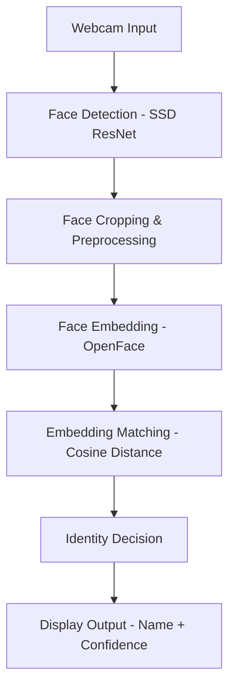
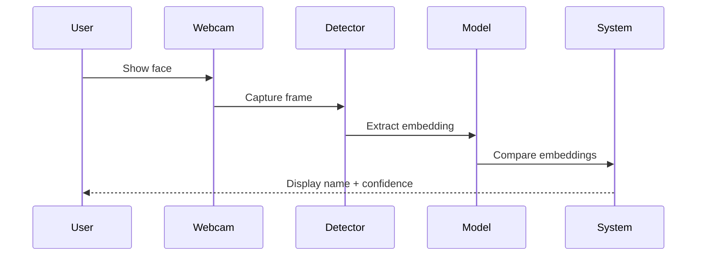
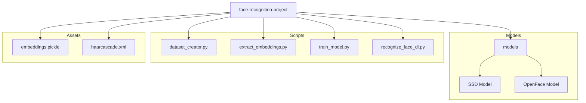

 
# Real-time-face-recognition-Deep-learning

Deep learning based real-time face recognition using OpenCV.

---

##  Project Overview

This project implements a **real-time face recognition system** using deep learning and OpenCV.  
It detects faces from a live webcam feed, extracts facial embeddings using a pre-trained neural network, and recognizes known individuals with a confidence score.

The system is designed to work reliably even under **moderate and low-light conditions**.

---

##  Technologies Used

- Python
- OpenCV (cv2)
- Deep Learning (OpenCV DNN module)
- OpenFace (Face Embedding Model)
- NumPy
- Pickle

---
## Models Used

| Task            | Model                                   | Description                          |
|-----------------|------------------------------------------|--------------------------------------|
| Face Detection  | SSD + ResNet (Caffe)                    | Detects faces in video frames        |
| Face Embedding  | OpenFace (`openface_nn4.small2.v1.t7`)  | Generates 128-D facial embeddings    |

---
## System Architecture

---
## System Workflow

---
##  Note:
This architecture represents the logical flow of the system.
No biometric data, personal images, or embeddings are exposed in this repository.

---

## Project Structure (Visual)

---

## System Workflow

1. **Dataset Creation**
   - Capture multiple face images per person using webcam
   - Images are stored class-wise (one folder per person)

2. **Embedding Extraction**
   - Each face is passed through the OpenFace model
   - 128-dimensional embeddings are generated

3. **Model Training**
   - Embeddings are stored in `embeddings.pickle`

4. **Real-Time Recognition**
   - Face detection using SSD + ResNet
   - Face recognition using cosine similarity
   - Name and confidence score displayed in real time

---

##  How to Run

1️. Create Face Dataset
``
python dataset_creator.py ``

2️. Extract Face Embeddings
``
python extract_embeddings.py``

3️. Train the Model
``
python train_model.py``

4️. Run Real-Time Face Recognition
``
python recognize_face_dl.py``

Press `ESC` to exit the application.

 ##  Confidence Calculation

Cosine distance is used to compare face embeddings:

``confidence = (1 - distance) × 100``

Lower distance indicates higher similarity and confidence.

 ##  Privacy & Ethics

Face images are not uploaded to GitHub

Only trained models and code are shared

Dataset remains local to the system

 ##  Limitations

Accuracy depends on dataset quality

Extreme lighting or occlusion may reduce recognition accuracy

Not intended for production-level surveillance
 ##  Future Enhancements

1.Face alignment for improved accuracy

2.Liveness detection

3.GPU acceleration

4.Web or mobile deployment

5.Multi-user large-scale dataset support

 ##  Author

Rakesh Pedapudi

B.Tech (Artificial Intelligence)
Focused on Computer Vision and Deep Learning

 ##  License

This project is licensed under the MIT License.

---
